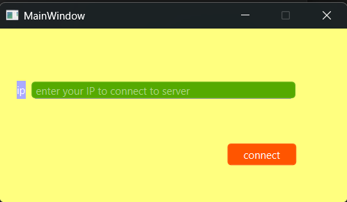
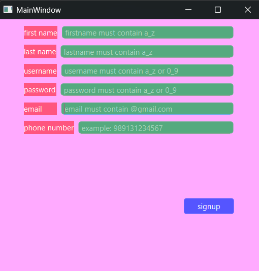
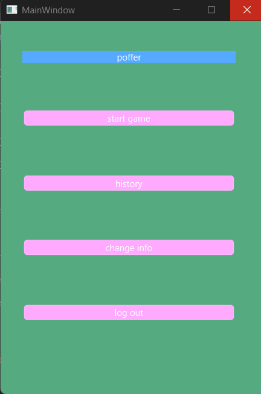
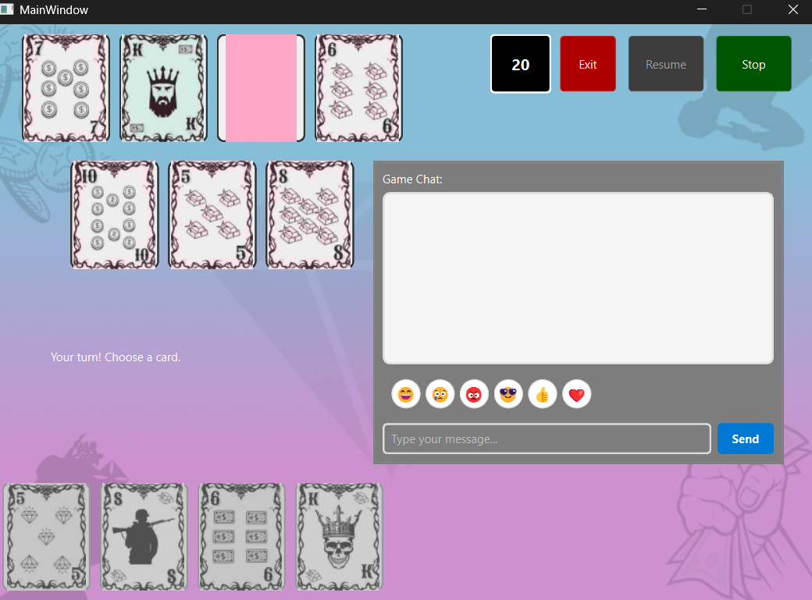


# Poffer Card Game - Technical Documentation
**Developed at Isfahan University of Technology (IUT)**

## 🛠️ Software Framework
- **Language:** Qt (C++)
- **Architecture:** Client-Server

## 👨‍💻 Development Team
- **Client Side:** Masih Bagheri
- **Server Side:** Ali Hamzeh

---

## 1. Introduction
Poffer is a strategic card game featuring:
- 4-player mode
- Advanced pattern recognition mechanics
- TCP/IP client-server communication
- SHA-256 password hashing

### Key Technologies:
- Object-Oriented Programming (OOP)
- Multithreading
- Polymorphism

---

## 2. Game Flow (Step-by-Step Guide)

This section provides a visual and descriptive guide on how to navigate the application, from the initial connection to starting a game.

### A. Connecting to the Server
The first step for any user is to establish a connection with the game server.


*(Screenshot: Connecting to the server)*

As shown in the image above, the user must enter the server's IP address into the designated field and click the **"connect"** button to proceed to the login/registration page.

### B. User Account Management

#### **Registration Process**
New users must create an account to play. By clicking the "signup" link on the login page, they are directed to the registration form.


*(Screenshot: User registration form)*

The user needs to fill in all the required fields. After completing the form and clicking **"signup"**, the user is redirected back to the sign-in page to log in with their new credentials.

#### **Login Process**
Registered users can access the game via the sign-in page.


*(Screenshot: User sign-in page)*

To log in, the user must enter their credentials:
- **Username:** Must be at least 4 characters long and contain English letters and numbers.
- **Password:** Must be at least 6 characters long and contain English letters and numbers.

The server validates this information against its database using a SHA-256 hash comparison for the password. The page also provides links for **"password recovery"** and **"signup"** for users who have forgotten their password or do not have an account.

### C. Main Menu
Upon a successful login, the user is greeted with the Main Menu, which serves as the central hub of the application.


*(Screenshot: Main menu)*

The menu offers the following options:
- **Start Game:** This is the primary button to enter the matchmaking queue and wait for a 4-player game to begin.
- **History:** Users can click here to view a record of their last 3 completed matches.
- **Change Info:** This section allows users to update their profile information.
- **Log Out:** Clicking this button will sign the user out of their account and close the application.

### D. The Main Game Screen
Once a match starts, the user is taken to the main game interface where the actual gameplay occurs.


*(Screenshot: The main gameplay interface)*

The game screen is composed of several key components:
- **Card Selection Area (Top-Left):** Seven cards are displayed here. The user must choose their cards from this selection to form their hand.
- **Player's Hand (Bottom-Left):** This area shows the five cards the user has currently selected.
- **Game Controls (Top-Right):** Three buttons are available for managing the game session:
    - **Stop:** Pauses the game.
    - **Resume:** Continues a paused game.
    - **Exit:** Allows the user to leave the current match.
- **Chat Window:** Located below the game controls, this feature enables real-time text communication between all players in the game.
- **Guidance Panel:** A dedicated section of the UI displays helpful messages and status updates to guide the player throughout the game.
- **Turn Timer:** A timer is visible to indicate that each player has a maximum of 30 seconds to make their move, after which an action may be automated as per the inactivity rules.

---

## 3. Game Mechanics
### Winning Patterns (Strength Order):

#### 1. Golden Hand (Rank 10)
- **Combination:** 5 high-value cards of same suit (Bitcoin, King, Queen, Soldier, 10)
- **Tiebreaker:** Suit priority: Diamond > Gold > Dollar > Coin

#### 2. Ordered Hand (Rank 9)
- **Combination:** 5 sequential cards of same suit
- **Tiebreaker:** Compare starting card

#### 3. Four Plus One (Rank 8)
- **Combination:** 4 same-value cards from different suits + 1 random
- **Tiebreaker:** Compare the 4-card set

#### 4. Penthouse (Rank 7)
- **Combination:** 3 same-value cards + 2 other same-value cards
- **Tiebreaker:** Compare the triple set

#### 5. High-Value Mess (Rank 6)
- **Combination:** 5 unsorted cards of same suit
- **Tiebreaker:** Compare cards from highest

#### 6. Series (Rank 5)
- **Combination:** 5 sequential cards from mixed suits
- **Tiebreaker:** Compare starting sequence

#### 7. Three Plus Two (Rank 4)
- **Combination:** 3 same-value cards + 2 random
- **Tiebreaker:** Compare the triple set

#### 8. Double Pair (Rank 3)
- **Combination:** Two pairs + 1 random card
- **Tiebreaker:** Compare pairs by strength

#### 9. Single Pair (Rank 2)
- **Combination:** One pair + 3 random cards
- **Tiebreaker:** Compare pair then remaining cards

#### 10. Messy Hand (Rank 1)
- **Combination:** No specific pattern
- **Tiebreaker:** Compare cards from highest

---

## 4. Special Case Handling
- **Disconnection:** 60-second reconnection window
- **Inactivity:** 20s delay → 10s warning → Random card selection
- **Player Exit:** Instant loss in 4-player mode

---

## 5. Technical Implementation
### Class Structure:
```cpp
class Card {
QString suit; // Diamond, Gold, Dollar, Coin
QString value; // Bitcoin, King, Queen, ...
};

---

## 📜 Final Notes
- In complete ties, suit priority determines the winner.
- Match history is stored in JSON format.

*This document maintains all original content and pattern hierarchy while being GitHub-compatible.*

### Key Conversion Notes:
1. **Pattern Preservation:**
   - All 10 patterns kept in original strength order (Rank 10 → Rank 1)
   - Card names literally translated (e.g., "دست طلایی" → "Golden Hand")

2. **Technical Terms:**
   - "هش SHA-256" → "SHA-256 hashing"
   - "چندنخی" → "Multithreading"

3. **Game-Specific Terms:**
   - "بیت‌کوین" → "Bitcoin" (kept as-is)
   - "سرباز" → "Soldier"
